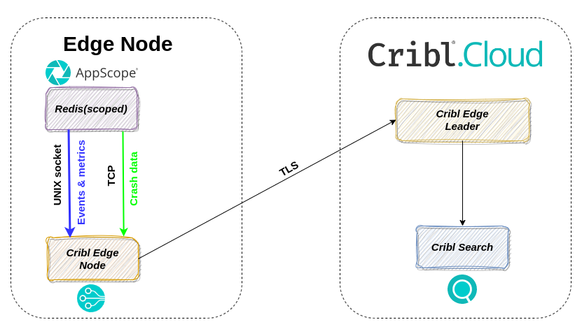

# appscopeCrashAnalysis
Demo to present AppScope Crash analysis capabilities using Cribl product

## Prerequisites

- Active Cribl Cloud account https://cribl.io/cribl-cloud/

Fill up `.env` file with cloud credentials values:

- `CLOUD_LEADER_HOSTNAME` - Leader Edge Node hostname
- `CLOUD_TOKEN` - Leader Edge Node’s shared secret (authToken)
- `CLOUD_FLEET_NAME` - Name of the cluster’s Worker Group.

See details [here](https://docs.cribl.io/edge/environment-variables/).

## Overview
This demo environment uses:

- [AppScope](https://cribl.io/appscope/)
- [Cribl.Cloud](https://cribl.io/cribl-cloud/)
- [Edge](https://cribl.io/edge/)
- [Search](https://cribl.io/search/)
- Redis as a scoped application

The schema below depicts the demo setup.



## Verify environment

To confirm that everything works correctly:

```bash
docker ps

CONTAINER ID   IMAGE                             COMMAND                  CREATED         STATUS        PORTS                                       NAMES
c6d3aa03a82b   appscopecrashanalysis_redis-app   "redis-server --prot…"   2 seconds ago   Up 1 second   0.0.0.0:6379->6379/tcp, :::6379->6379/tcp   redis-app
463a313d5554   cribl/cribl:latest                "/sbin/entrypoint.sh…"   2 seconds ago   Up 1 second                                               edge-node1
```

## Building

To build the demo:

```bash
./start.sh
```

## Cleaning up after a session

To clean up the demo environment:

```bash
./stop.sh
```

## Scope example application (redis-app)

```bash
sudo ./bin/linux/x86_64/scope attach -c edge --backtrace --coredump redis-server
```

## Start scope daemon

```bash
sudo ./bin/linux/x86_64/scope daemon --filedest localhost:10087
```
